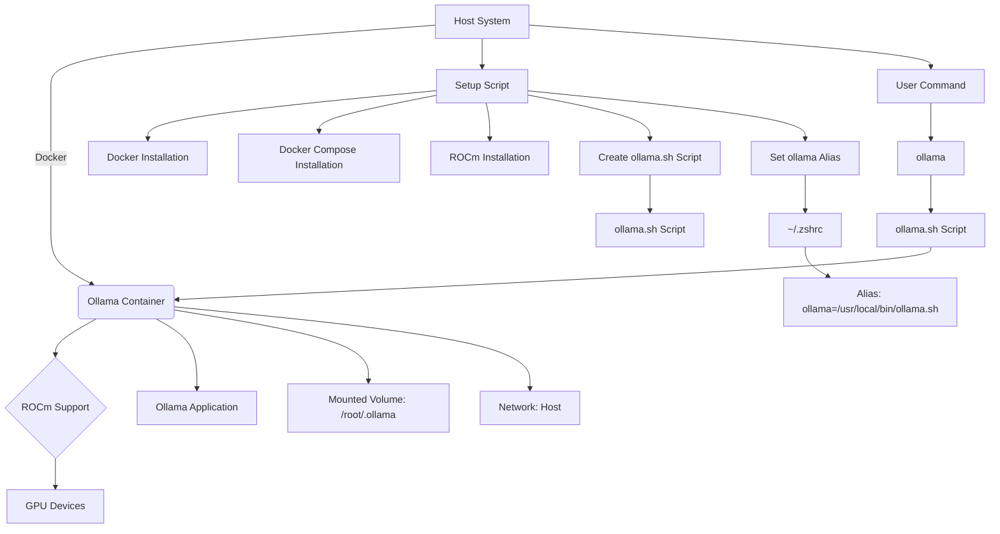

# Ollama ROCm Docker Setup

Welcome to the `ollama_amd_rocm_docker` repository. This project is designed to streamline the process of setting up and running Ollama within a Docker container using AMD's ROCm for GPU acceleration.

## Quickstart

Get started with a single command:

```bash
curl -fsSL https://raw.githubusercontent.com/ouic/ollama_amd_rocm_docker/main/setup.sh | bash
```

## Why containerize Ollama with ROCm?

- **Isolation**: Keeps Ollama and its dependencies contained, preventing conflicts with other applications.
- **Reproducibility**: Ensures consistent performance across different environments.
- **Scalability**: Easily scale your containers to manage workload fluctuations.
- **Portability**: Run your containers anywhere Docker is supported.
- **Simplified Dependency Management**: All dependencies are packaged within the container.
- **Security**: Isolates applications to minimize risks of conflicts and vulnerabilities.

## About the `drun` Command and `docker-rocm-xtra`

This setup uses the `drun` command to run Docker containers with ROCm support, inspired by the [docker-rocm-xtra project](https://github.com/ulyssesrr/docker-rocm-xtra). The `drun` alias includes essential environment variables and device mappings, ensuring smooth GPU utilization.

## Prerequisites

Ensure your system meets the following requirements:

- Ubuntu 22.04 or later
- A compatible AMD GPU
- Internet connection

## Installation

1. **Clone the repository**:
   ```bash
   git clone https://github.com/ouic/ollama_amd_rocm_docker.git
   cd ollama_amd_rocm_docker
   ```

2. **Run the setup script**:
   ```bash
   chmod +x setup.sh
   ./setup.sh
   ```

   The script installs Docker, Docker Compose, ROCm, and sets up necessary aliases.

## Usage

After running the setup script, reboot, then you can use the `ollama` command to operate Ollama within the Docker container.

### Running Ollama

Simply use the `ollama` command followed by any necessary arguments:

```bash
ollama <your_command_arguments>
```

This command runs the `ollama/ollama:rocm` Docker image with GPU configurations.

### Ollama Command Alias

The setup script creates an `ollama` alias, making it easy to run Ollama within the Docker container as if it were installed locally.

## Models and Commands

### Available Models

Run various models with simple commands. Examples include:

| Model              | Parameters | Size  | Command                        |
|--------------------|------------|-------|--------------------------------|
| Llama 3            | 8B         | 4.7GB | `ollama run llama3`            |
| Llama 3            | 70B        | 40GB  | `ollama run llama3:70b`        |
| Phi 3 Mini         | 3.8B       | 2.3GB | `ollama run phi3`              |
| Gemma 2            | 9B         | 5.5GB | `ollama run gemma2`            |
| Mistral            | 7B         | 4.1GB | `ollama run mistral`           |
| Neural Chat        | 7B         | 4.1GB | `ollama run neural-chat`       |

> Note: Ensure you have sufficient RAM to run these models: 8 GB for 7B models, 16 GB for 13B models, and 32 GB for 33B models.

### Customizing a Model

Customize models using a `Modelfile`. For instance, to tailor the `llama3` model:

1. **Pull the model**:
   ```bash
   ollama pull llama3
   ```

2. **Create a Modelfile**:
   ```bash
   nano Modelfile
   ```
   Add the following content:
   ```
   FROM llama3
   PARAMETER temperature 1
   SYSTEM """
   You are Mario from Super Mario Bros. Answer as Mario, the assistant, only.
   """
   ```

3. **Create and run the model**:
   ```bash
   ollama create mario -f ./Modelfile
   ollama run mario
   ```

## Container Structure

The following Mermaid UML diagram illustrates the container structure and alias setup:



## Sources

- **ROCm**:
  The ROCm (Radeon Open Compute) platform is an open-source software stack for GPU computing. Visit the [ROCm GitHub repository](https://github.com/RadeonOpenCompute/ROCm) and the [official ROCm documentation](https://rocmdocs.amd.com/en/latest/).

- **Ollama**:
  Ollama is a language model implementation. For more details, refer to the [Ollama GitHub repository](https://github.com/ollama/ollama) and the related documentation.